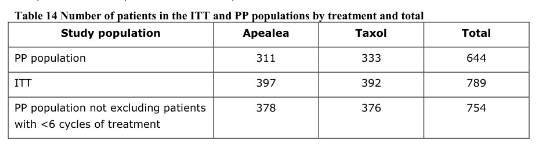
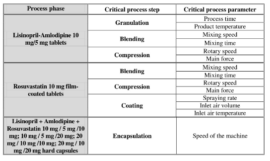
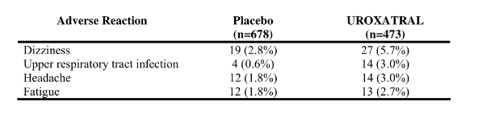
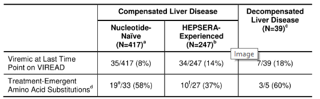

# TNCR: Table Net Detection and Classification Dataset
[](https://pytorch.org/)
[](https://github.com/open-mmlab/mmdetection)


> **TNDR: Table Net Detection and Recognition Dataset**<br>
> [Abdelrahman Abdallah](https://github.com/abdoelsayed2016),
> [Alexander Berendeev](),
> [Islam Nuradin](),
> [Daniyar Nurseitov](),
> <br>
  

## Abstract 
We present TNCR, a new table dataset with varying image quality collected from free open source websites. TNCR dataset can be used for table detection in scanned document images and their classification into 5 different classes. TNCR contains 9428 high-quality labeled images. In this paper, we have implemented state-of-the-art deep learning-based methods for table detection to create several strong baselines. Cascade Mask R-CNN  with ResNeXt-101-64x4d Backbone Network achieves the highest performance compared to other methods with a precision of 79.7%, recall of 89.8%, and f1 score of 84.4% on the TNCR dataset. We have made TNCR open source in the hope of encouraging more deep learning approaches to table detection, classification and structure recognition. 
## Getting Started
### Install MMDetection v2.10.0+
TNDR has been implemented and tested with Python 3.7 and PyTorch 1.8.1. 
```
%cd $project_dir$
!pip install -q mmcv terminaltables
!git clone 'https://github.com/open-mmlab/mmdetection.git'
!pip install -r "$project_dir$/mmdetection/requirements/optional.txt"
%cd mmdetection/
!python setup.py install
!python setup.py develop
!pip install -r {"$project_dir$/mmdetection/requirements.txt"}
!pip install pillow
!pip install mmcv
!pip install mmcv-full
%cd ..
!pip uninstall pycocotools
!pip uninstall mmpycocotools
!pip install mmpycocotools
```


## requirements
```
Python: 3.7 
PyTorch: 1.8.1
OpenCV: 4.5.2
MMCV: 1.3.5
MMDetection: v2.10.0
```

##  TNDR Dataset
in the following Figures show the number of class in the dataset. Since for three classes (No lines, Partial lined merged cells, Partial lined). You can download the dataset through this  <a href="https://aunedu-my.sharepoint.com/:f:/g/personal/abdelrahmanelsayed_aun_edu_eg/EgXnk6DGzN9DlYV8jaiGPRcBXPjt3xqgKjPi07DFoM5pGw?e=6CPFGZ">link</a>
<figure>
      <figcaption>Full Lined</figcaption>
      
</figure>
<figure>
        <figcaption>Merged Cells</figcaption>
             
</figure>
<figure>
        <figcaption>No lines</figcaption>
          
</figure>
<figure>
        <figcaption>Partial Lined</figcaption>
        
        
</figure>
<figure>
  <figcaption>Partial Lined Merged Cells</figcaption>
        
        
</figure>


##  Models Zoo
All config  and checkpoint files available in this <a href="https://aunedu-my.sharepoint.com/:f:/g/personal/abdelrahmanelsayed_aun_edu_eg/En6ueJ33IlxHhdGXrxI9KqABTtYNWhxrT4rZZbF8Zx9ywQ?e=iYX9su">link</a> 

Checkout our demo notebook for loading checkpoints and performing inference <br>[](https://drive.google.com/file/d/1lI0ghISktOYkEpaxDEsnEyQ2botA34oB/view?usp=sharing)<br>
#### 1. Cascade Mask R-CNN

<table>
  <tr>
   <th>Backbones</th><th>Config Files</th><th>Checkpoint File</th>
  </tr>
  <tr>
   <td>  Resnet-50_1x </td> <td>  <a href="https://aunedu-my.sharepoint.com/:u:/g/personal/abdelrahmanelsayed_aun_edu_eg/EQ9WtrqjQrNDtbJh2nt8iIkBCEDQvXT--DvR1_EcUpoKrw?e=mRaCvc">Config Files</a> </td> <td> <a href="https://aunedu-my.sharepoint.com/:u:/g/personal/abdelrahmanelsayed_aun_edu_eg/EWy19074DWVLiBARaYS6ZlIBvXUCcAQeZQ9ivbRJItOXqA?e=YEvHb1">Checkpoint</a> </td>    
  </tr>
  <tr>
    <td> Resnet-50_20e </td>   <td>  <a href="https://aunedu-my.sharepoint.com/:u:/g/personal/abdelrahmanelsayed_aun_edu_eg/EWPXWRjY1HlJnxfz3yBGCVABiQ81PjJo-LL_mB4IxVi33Q?e=X9US8Y">Config Files</a> </td> <td> <a href="https://aunedu-my.sharepoint.com/:u:/g/personal/abdelrahmanelsayed_aun_edu_eg/Ee82uMoBmiVGuaqE6zuP73UBRBC2iZSd2LjZ4jMj4fiyrA?e=HmN4Vq">Checkpoint</a> </td>   
  </tr>
   <tr>
    <td> Resnet-101_1x </td>  <td>  <a href="https://aunedu-my.sharepoint.com/:u:/g/personal/abdelrahmanelsayed_aun_edu_eg/EX0U66RbUlFEg0Wcjt9j78oBrL89JT_XNHTuBc3e4JWjDQ?e=4aEhOg">Config Files</a> </td> <td> <a href="https://aunedu-my.sharepoint.com/:u:/g/personal/abdelrahmanelsayed_aun_edu_eg/EfMVfmeEMuJBgjYsIRIr0WUBDDtSrOEd7DQ_uGjPGRVnmQ?e=wJLdnx">Checkpoint</a> </td>
  </tr>
   <tr>
    <td> Resnet-101_20e </td>  <td>  <a href="https://aunedu-my.sharepoint.com/:u:/g/personal/abdelrahmanelsayed_aun_edu_eg/EXXEAcPOXddLhhDsQ96oetABj6fc1fGcKqZoaG2m3Uh8Fw?e=4XhIzH">Config Files</a> </td> <td> <a href="https://aunedu-my.sharepoint.com/:u:/g/personal/abdelrahmanelsayed_aun_edu_eg/EUPIZwIajn5Eo_vR355c5jABxugHxmkPJd1ilP8uIp43CA?e=gWmRcC">Checkpoint</a> </td>
  </tr>
   <tr>
   <td> ResNeXt-101-32x4d_1x </td>   <td>  <a href="https://aunedu-my.sharepoint.com/:u:/g/personal/abdelrahmanelsayed_aun_edu_eg/Ef6XbyoOjopIuKyUBO1zKzoBmFCCBKZlFq1rBzi9E6Fn8w?e=0C8c7j">Config Files</a> </td> <td> <a href="https://aunedu-my.sharepoint.com/:u:/g/personal/abdelrahmanelsayed_aun_edu_eg/Eej0Y2lpZz1Lv5DEBk_OIJEBWyLKH8BY1COekzXqY5nOLw?e=KqI3FS">Checkpoint</a> </td>
  </tr>
   <tr>
    <td> ResNeXt-101-64x4d_1x </td>  <td>  <a href="https://aunedu-my.sharepoint.com/:u:/g/personal/abdelrahmanelsayed_aun_edu_eg/ERm0F78gX3dNm6PEItKg5ZQB4k3QKr3aZpEeNW6MKtkqmw?e=bWlMmJ">Config Files</a> </td> <td> <a href="https://aunedu-my.sharepoint.com/:u:/g/personal/abdelrahmanelsayed_aun_edu_eg/ETs60n82gIhBvMlbFtX7oGQBKKQ5Q2sYuNgpnR9qJNtCLA?e=ldUlW8">Checkpoint</a> </td>
  </tr>
</table>

#### 2. Cascade R-CNN

<table>
  <tr>
   <th>Backbones</th><th>Config Files</th><th>Checkpoint File</th>
  </tr>
  <tr>
   <td>  Resnet-50_1x </td> <td>  <a href="https://aunedu-my.sharepoint.com/:u:/g/personal/abdelrahmanelsayed_aun_edu_eg/Ee_CQqEVZl1GlmRaxI3mgisBtzTOVyopczt7dNINZEyGQg?e=V0BjlH">Config Files</a> </td> <td> <a href="https://aunedu-my.sharepoint.com/:u:/g/personal/abdelrahmanelsayed_aun_edu_eg/EWA8q1EO5hVCs9T_SdywLaoBlRJFiMVk9bxZaY3ZfeXDhA?e=JWqS09">Checkpoint</a> </td>
  </tr>
  <tr>
    <td> Resnet-50_20e </td>  <td>  <a href="https://aunedu-my.sharepoint.com/:u:/g/personal/abdelrahmanelsayed_aun_edu_eg/ERGYhr7QtbxOn3NeaF3NOTgBpvpDYBUv9xx2xlbLMwZVfw?e=vXS7WV">Config Files</a> </td> <td> <a href="https://aunedu-my.sharepoint.com/:u:/g/personal/abdelrahmanelsayed_aun_edu_eg/EQ8cJ2BaT8VPn5VwJiFsApUBaywMHdwscRmI_E8Vwmergw?e=aMlTbr">Checkpoint</a> </td>
  </tr>
   <tr>
    <td> Resnet-101_1x </td> <td> <a href="https://aunedu-my.sharepoint.com/:u:/g/personal/abdelrahmanelsayed_aun_edu_eg/EdvxVb-H-mxDm_rOLfs3SGQBH_f75OC2wVEuU704D5ZwTA?e=WHGcfa">Config Files</a> </td> <td> <a href="https://aunedu-my.sharepoint.com/:u:/g/personal/abdelrahmanelsayed_aun_edu_eg/EQ154p-WQpNNg5J-2W7HHssBryz8GXsg_ubHJGUNV0vApQ?e=Axbjnn">Checkpoint</a> </td>  
  </tr>
   <tr>
    <td> Resnet-101_20e </td>  <td>  <a href="https://aunedu-my.sharepoint.com/:u:/g/personal/abdelrahmanelsayed_aun_edu_eg/ER05mqA5nYhCswPJc7MkJ-sBekGmQiauMI-0JIpwSbg5Iw?e=4n8TeJ">Config Files</a> </td> <td> <a href="https://aunedu-my.sharepoint.com/:u:/g/personal/abdelrahmanelsayed_aun_edu_eg/EYSVOk_6xXFGoplQd7ovVsgBhDdf16IEhH2vVSO1-bHWtA?e=pvbtsH">Checkpoint</a> </td>
  </tr>
   <tr>
   <td> ResNeXt-101-32x4d_1x </td>   <td>  <a href="https://aunedu-my.sharepoint.com/:u:/g/personal/abdelrahmanelsayed_aun_edu_eg/EZfnx23OjiNGlxOLHlGAMEABOEHhQpikLoPcr-vXvA7clw?e=YoCnFj">Config Files</a> </td> <td> <a href="https://aunedu-my.sharepoint.com/:u:/g/personal/abdelrahmanelsayed_aun_edu_eg/EWZ6dLR2ta1Fn9jebIF1M4QBdKg2EevWpK0gzoHPH5JWvg?e=a7iPpL">Checkpoint</a> </td>
  </tr>
   <tr>
    <td> ResNeXt-101-64x4d_1x </td>  <td>  <a href="https://aunedu-my.sharepoint.com/:u:/g/personal/abdelrahmanelsayed_aun_edu_eg/EcNBZdJQ4oVImBf9lirPhpEBAwZFJK4teZM4dGPyEu19Bw?e=UMAPD6">Config Files</a> </td> <td> <a href="https://aunedu-my.sharepoint.com/:u:/g/personal/abdelrahmanelsayed_aun_edu_eg/EZJfLqv0pehDjBJJyK70C-kBOT-ta8J0r9BARVX3msUi7w?e=QVWkLK">Checkpoint</a> </td>
  </tr>
</table>

<!--
#### 3. Faster R-CNN
<table>
  <tr>
   <th>Backbones</th><th>Config Files</th><th>Checkpoint File</th>
  </tr>
  <tr>
   <td>  Resnet-50_L1Loss </td> <td> <a href="https://aunedu-my.sharepoint.com/:u:/g/personal/abdelrahmanelsayed_aun_edu_eg/Ef1r-jmBhb1El6Nn8ZtCt_MB9KayjEO83jNNgzDdpJN8ag?e=SPtSEx">Config Files</a> </td> <td> <a href="https://aunedu-my.sharepoint.com/:u:/g/personal/abdelrahmanelsayed_aun_edu_eg/EfmD2Hx4VJJKhnx9g9xS0d0BfgzpzGIiUGDgDfH-IecFlw?e=jU2llm">Checkpoint</a> </td>
  </tr>
  <tr>
    <td> Resnet-50_1x </td>  <td>  <a href="https://aunedu-my.sharepoint.com/:u:/g/personal/abdelrahmanelsayed_aun_edu_eg/Eby5K07AvgdIrpL5LpxxJk8BoTvJRrstUfOAKlhHEi4pnQ?e=SIh9kd">Config Files</a> </td> <td> <a href="https://aunedu-my.sharepoint.com/:u:/g/personal/abdelrahmanelsayed_aun_edu_eg/EWMdj3I5kQRLi9OU3wFuCPkBv2_1LCsZZkNDe9rfJeJf0w?e=RCDUBO">Checkpoint</a> </td>
  </tr>
   <tr>
    <td> Resnet-101_1x </td>  <td>  <a href="https://aunedu-my.sharepoint.com/:u:/g/personal/abdelrahmanelsayed_aun_edu_eg/EUs2EIbKopFHoH39dHCuEckBk9yqINFip2IvHgosjsda3Q?e=Op0VaK">Config Files</a> </td> <td> <a href="https://aunedu-my.sharepoint.com/:u:/g/personal/abdelrahmanelsayed_aun_edu_eg/EeFCYhlXDx5JkVzGrmrWizIBewYY0vcSJxhT2J5WeSwlbw?e=yboJna">Checkpoint</a> </td>
  </tr>
   <tr>
   <td> ResNeXt-101-32x4d_1x </td>   <td>  <a href="https://aunedu-my.sharepoint.com/:u:/g/personal/abdelrahmanelsayed_aun_edu_eg/EYP7qJ79xDFOoGg0mxufD4gB7rcEBLjzoZQikh_6Qe3A1g?e=dUTKAj">Config Files</a> </td> <td> <a href="https://aunedu-my.sharepoint.com/:u:/g/personal/abdelrahmanelsayed_aun_edu_eg/EevaAYeIMLNLoxPkJinSohcBzhkW5bQBJJ9eQ-vjXX8M1g?e=sMyKqv">Checkpoint</a> </td>
  </tr>
   <tr>
    <td> ResNeXt-101-64x4d_1x </td>  <td>  <a href="https://aunedu-my.sharepoint.com/:u:/g/personal/abdelrahmanelsayed_aun_edu_eg/EaByQDxobC5EkG47fSbIerUBYNn78t_K2fDjkz1d5cXzEA?e=gJfOrd">Config Files</a> </td> <td> <a href="https://aunedu-my.sharepoint.com/:u:/g/personal/abdelrahmanelsayed_aun_edu_eg/EQpxMuCYO3lGmwH4MPFNJDwBFTb9nxoJ2uNAcYZMybt9IQ?e=ZWDJde">Checkpoint</a> </td>
  </tr>
</table>
-->
<!--
#### 4. Mask R-CNN
<table>
  <tr>
   <th>Backbones</th><th>Config Files</th><th>Checkpoint File</th>
  </tr>
  <tr>
   <td>  Resnet-50_1x </td>  <td>  <a href="https://aunedu-my.sharepoint.com/:u:/g/personal/abdelrahmanelsayed_aun_edu_eg/ETMmRjOs7_ZJouEofxkjBlUB0Zt5LH_cGPMjaejprfXBIA?e=cLJ4up">Config Files</a> </td> <td> <a href="https://aunedu-my.sharepoint.com/:u:/g/personal/abdelrahmanelsayed_aun_edu_eg/EfASLLKVoDhDhLqDZEGoONYBPhHPgRX8y3TM2APhldtfPw?e=NPoweK">Checkpoint</a> </td>
  </tr>
   <tr>
    <td> Resnet-101_1x </td> <td> <a href="https://aunedu-my.sharepoint.com/:u:/g/personal/abdelrahmanelsayed_aun_edu_eg/EahpY_y5rmpIov73YQqH8LsBkdUDi_GoDxauXQcyAKrfmg?e=6Bedf7">Config Files</a> </td> <td> <a href="https://aunedu-my.sharepoint.com/:u:/g/personal/abdelrahmanelsayed_aun_edu_eg/EYvOXIgHxLVPjaw_y7hd4DQBvpDZEuMb8JCCEegTMnk86A?e=5NvTlI">Checkpoint</a> </td>
  </tr>
   <tr>
   <td> ResNeXt-101-32x4d_1x </td>   <td>  <a href="https://aunedu-my.sharepoint.com/:u:/g/personal/abdelrahmanelsayed_aun_edu_eg/Ed31pM9BqoFGoEiVvYgIassBPsIkFGIWrotY3kywriRh9g?e=PFggIo">Config Files</a> </td> <td> <a href="https://aunedu-my.sharepoint.com/:u:/g/personal/abdelrahmanelsayed_aun_edu_eg/Ec52yUzqyAxBnYgBs6ca_5MBcunLLs4OzYBPSWjvfAOl6Q?e=eMsAlm">Checkpoint</a> </td>
  </tr>
   <tr>
    <td> ResNeXt-101-64x4d_1x </td>  <td>  <a href="https://aunedu-my.sharepoint.com/:u:/g/personal/abdelrahmanelsayed_aun_edu_eg/ETUkxfQ1miZHvuf5arXztLoB0vTMDevpIaCPioVENyIEgQ?e=0yu9VU">Config Files</a> </td> <td> <a href="https://aunedu-my.sharepoint.com/:u:/g/personal/abdelrahmanelsayed_aun_edu_eg/Ea6DcWMbfdhBoRjAEYS4Q-ABvrtgbkMvZYhyVSIn20m6JQ?e=2wLecp">Checkpoint</a> </td>
  </tr>
</table>

-->

#### 3. Cascade RPN
<table>
  <tr>
    <th>Method</th> <th>Backbones</th><th>Config Files</th><th>Checkpoint File</th>
  </tr>
  <tr>
   <th>Fast R-CNN </th> <td>  Resnet-50_1x </td> <td> <a href="https://aunedu-my.sharepoint.com/:u:/g/personal/abdelrahmanelsayed_aun_edu_eg/ERpKsnBebkNKvrCZADhnsSEB_qxXCFZ1KLxOdMyL3GDlmw?e=uFzgIp">Config Files</a> </td> <td> <a href="https://aunedu-my.sharepoint.com/:u:/g/personal/abdelrahmanelsayed_aun_edu_eg/Eby9ri2GQ7FAtYMJeSWrYiEB-pu_0CakdG1i5S28aa7sAg?e=ES85ph">Checkpoint</a> </td>
  </tr>
   <tr>
    <th>CRPN </th> <td> Resnet-50_1x </td>  <td>  <a href="https://aunedu-my.sharepoint.com/:u:/g/personal/abdelrahmanelsayed_aun_edu_eg/Ed5gbUSSYPNAuQOT0CGGidcBlBlHs2ljTICW4RykQhGwig?e=RFJHLM">Config Files</a> </td> <td> <a href="https://aunedu-my.sharepoint.com/:u:/g/personal/abdelrahmanelsayed_aun_edu_eg/EcW9YXCUOpZHpdbQe6hIpb0BF22zY9Cp89cgpuMsp1_pRw?e=I6yCrL">Checkpoint</a> </td>
  </tr>
  
</table>


#### 4. Hybrid Task Cascade
<table>
  <tr>
   <th>Backbones</th><th>Config Files</th><th>Checkpoint File</th>
  </tr>
  <tr>
   <td>  Resnet-50_1x </td> <td> <a href="https://aunedu-my.sharepoint.com/:u:/g/personal/abdelrahmanelsayed_aun_edu_eg/Ef50rW0HqhxKpjw0WNwMwEsBUMtRUC9TbvGH5MZJFjNdOg?e=yrSyB1">Config Files</a> </td> <td> <a href="https://aunedu-my.sharepoint.com/:u:/g/personal/abdelrahmanelsayed_aun_edu_eg/EVEXe5fkJ25HlmmX_JpWjqQBcx0Wm4ipiTkIF644ip67lQ?e=hjHucQ">Checkpoint</a> </td>
  </tr>
   <tr>
    <td> Resnet-50_20e </td>  <td>  <a href="https://aunedu-my.sharepoint.com/:u:/g/personal/abdelrahmanelsayed_aun_edu_eg/EblIF2COv4ZOguLamgVfDw8BjnFU51llomeuRQ8ky7SUKg?e=Xq1K4c">Config Files</a> </td> <td> <a href="https://aunedu-my.sharepoint.com/:u:/g/personal/abdelrahmanelsayed_aun_edu_eg/EV-jktkPDOlPgSLIvUITXTABAnSBVnWl-hokBW7VDNdkxg?e=tfGaR7">Checkpoint</a> </td>
  </tr>
   <tr>
   <td> Resnet-101_1x </td>   <td>  <a href="https://aunedu-my.sharepoint.com/:u:/g/personal/abdelrahmanelsayed_aun_edu_eg/EZkDuiBq7VFCorveN_1-GacBmuauFL22Ja5R4Zq0vy0dQQ?e=YNE4vl">Config Files</a> </td> <td> <a href="https://aunedu-my.sharepoint.com/:u:/g/personal/abdelrahmanelsayed_aun_edu_eg/EQZjsvA4QzFAsEefShuV0NQBQY6wE24v6YsQYd6c-5dqLg?e=hPoN9i">Checkpoint</a> </td>
  </tr>
   
</table>

<!--
#### 7. HRNets
##### 7.1 Cascade R-CNN
<table>
  <tr>
   <th>Backbones</th><th>Config Files</th><th>Checkpoint File</th>
  </tr>
  <tr>
   <td>  HRNetV2p-W18_20e </td> <td> <a href="https://aunedu-my.sharepoint.com/:u:/g/personal/abdelrahmanelsayed_aun_edu_eg/EaVzTcuo1zpLkNRt25Ohr6IB90cvAuLUehiPuf7sCA58TQ?e=EN1fX9">Config Files</a> </td> <td> <a href="https://aunedu-my.sharepoint.com/:u:/g/personal/abdelrahmanelsayed_aun_edu_eg/EXCk-XpDjLRNv6Owuv5FDyQB3kPTIAB7qilssdn4N4wMiQ?e=aX0IoE">Checkpoint</a> </td>
  </tr>
   <tr>
    <td> HRNetV2p-W32_20e </td>  <td>  <a href="https://aunedu-my.sharepoint.com/:u:/g/personal/abdelrahmanelsayed_aun_edu_eg/EfhYtFkFW1pFiwl3k9WIt6EB6B2Pt2lSEaj4a6QPFEBcsw?e=93SdMh">Config Files</a> </td> <td> <a href="https://aunedu-my.sharepoint.com/:u:/g/personal/abdelrahmanelsayed_aun_edu_eg/EUzwOf9IxhNOu3i8ZDN_NJ4B3vgrLN7A_s5scfTkFqFXAg?e=s34PNr">Checkpoint</a> </td>
  </tr>
   <tr>
   <td> HRNetV2p-W40_20e </td>   <td>  <a href="hhttps://aunedu-my.sharepoint.com/:u:/g/personal/abdelrahmanelsayed_aun_edu_eg/ETc2VyunR8BBkjHSqq2Jf-IBNK1_Pgzv_0XZDGcg2sYefQ?e=7VucHw">Config Files</a> </td> <td> <a href="https://aunedu-my.sharepoint.com/:u:/g/personal/abdelrahmanelsayed_aun_edu_eg/EUylclj8aXpGjdQNo3HUi5gBG2Zcurc6gECQp1QK88CLWg?e=EAkMc4">Checkpoint</a> </td>
  </tr>
   
</table>

##### 7.2 Faster R-CNN
<table>
  <tr>
   <th>Backbones</th><th>Config Files</th><th>Checkpoint File</th>
  </tr>
  <tr>
   <td>  HRNetV2p-W18_1x </td> <td> <a href="https://aunedu-my.sharepoint.com/:u:/g/personal/abdelrahmanelsayed_aun_edu_eg/EVhL5ixPV0BDlw6yrjvW5uYBLmoO4GKUVtN4gPM_nQytzg?e=KkWZEK">Config Files</a> </td> <td> <a href="https://aunedu-my.sharepoint.com/:u:/g/personal/abdelrahmanelsayed_aun_edu_eg/EdjWhkzTShxLv-KoYX7pvvkBVAOZfpyInOlQslFcmIEvwQ?e=U1AGa2">Checkpoint</a> </td>
  </tr>
  <tr>
   <td>  HRNetV2p-W18_2x </td> <td> <a href="https://aunedu-my.sharepoint.com/:u:/g/personal/abdelrahmanelsayed_aun_edu_eg/ER_EwF9BLoJCs-4FUbBG_bUB9oi8TrMTGYbT1o3uyMEgoQ?e=m3IDTu">Config Files</a> </td> <td> <a href="https://aunedu-my.sharepoint.com/:u:/g/personal/abdelrahmanelsayed_aun_edu_eg/EcSjcxtcAVNEmFYw_wDOWzIBsFBOi-aiZJr6MO5JCRtaqg?e=7JTqkH">Checkpoint</a> </td>
  </tr>
   <tr>
    <td> HRNetV2p-W32_1x </td>  <td>  <a href="https://aunedu-my.sharepoint.com/:u:/g/personal/abdelrahmanelsayed_aun_edu_eg/ETsSCzNMXblLmebAYtcnoQUBHgScN4wHQ8HLayF1qNwDTg?e=agjODU">Config Files</a> </td> <td> <a href="https://aunedu-my.sharepoint.com/:u:/g/personal/abdelrahmanelsayed_aun_edu_eg/EUWESn7mQlZMs8PKXocYhM8BvErjFqie0xL4Pxte4Gt76Q?e=zjVSOd">Checkpoint</a> </td>
  </tr>
     <tr>
    <td> HRNetV2p-W32_2x </td>  <td>  <a href="https://aunedu-my.sharepoint.com/:u:/g/personal/abdelrahmanelsayed_aun_edu_eg/EaO6bT5KUfFBmQtQoujhy4QBgCRD8uP2HaeCUQTOGTavLQ?e=n7ayAe">Config Files</a> </td> <td> <a href="https://aunedu-my.sharepoint.com/:u:/g/personal/abdelrahmanelsayed_aun_edu_eg/EVK0DUG8Zo9FmzvufUIx1PEBpreF0Td_ZgQ8hDVwZdoM_Q?e=vIQZwm">Checkpoint</a> </td>
  </tr>
   <tr>
   <td> HRNetV2p-W40_1x </td>   <td>  <a href="https://aunedu-my.sharepoint.com/:u:/g/personal/abdelrahmanelsayed_aun_edu_eg/ERT04aBlsSlJmpyHNySZg2MBGQw4Ty243AQ90qDXeHQG4Q?e=rDXiFv">Config Files</a> </td> <td> <a href="https://aunedu-my.sharepoint.com/:u:/g/personal/abdelrahmanelsayed_aun_edu_eg/ETr5me7tB85JlkqULVN-prMBsJosUQEeJMeThkwKuNUvsw?e=f4LVuo">Checkpoint</a> </td>
  </tr>
    <tr>
   <td> HRNetV2p-W40_2x </td>   <td>  <a href="https://aunedu-my.sharepoint.com/:u:/g/personal/abdelrahmanelsayed_aun_edu_eg/EX0eOcNZGHBDsYXmuoYGHOcBIbpYVdbuQwrgVFAWPWhO5Q?e=ueDvYq">Config Files</a> </td> <td> <a href="https://aunedu-my.sharepoint.com/:u:/g/personal/abdelrahmanelsayed_aun_edu_eg/Eer1wsHE0bRNpuGlwQReRX4BLsQPQN6A3eJAVxAGozBrLg?e=d8Pz4b">Checkpoint</a> </td>
  </tr>
</table>

##### 7.3 HTC 
<table>
  <tr>
   <th>Backbones</th><th>Config Files</th><th>Checkpoint File</th>
  </tr>
  <tr>
   <td>  HRNetV2p-W18_20e </td> <td>  <a href="https://aunedu-my.sharepoint.com/:u:/g/personal/abdelrahmanelsayed_aun_edu_eg/EfGA3SIz7yxIn0aCkUtEQoQBrFwqAX8TQ4sX15amJFYV9Q?e=RoUK1x">Config Files</a> </td> <td> <a href="">Checkpoint</a> </td>
  </tr>

   <tr>
    <td> HRNetV2p-W32_20e </td>  <td>  <a href="https://aunedu-my.sharepoint.com/:u:/g/personal/abdelrahmanelsayed_aun_edu_eg/EeAqz7yzPmxKuV6EPAvCGqIBNafwer2r9i5tHFzgd85gHQ?e=llqbUk">Config Files</a> </td> <td> <a href="https://aunedu-my.sharepoint.com/:u:/g/personal/abdelrahmanelsayed_aun_edu_eg/EeAqz7yzPmxKuV6EPAvCGqIBdRn8MWBS3VbnL3n1Y_yRBQ?e=OMqQmi">Checkpoint</a> </td>
  </tr>

</table>

##### 7.4 Mask R-CNN
<table>
  <tr>
   <th>Backbones</th><th>Config Files</th><th>Checkpoint File</th>
  </tr>
  <tr>
   <td>  HRNetV2p-W18_1x </td> <td> <a href="https://aunedu-my.sharepoint.com/:u:/g/personal/abdelrahmanelsayed_aun_edu_eg/EcTYhVojTQtFgympovBdQV8BN-HnFlihTCmGxKTUKWEhUg?e=XKBWOZ">Config Files</a> </td> <td> <a href="https://aunedu-my.sharepoint.com/:u:/g/personal/abdelrahmanelsayed_aun_edu_eg/EfK6gAbPaCJGmVQusloMjj4Bj_IPTaC4_T-BwSRxhLzd9A?e=aXd19v">Checkpoint</a> </td>
  </tr>

   <tr>
    <td> HRNetV2p-W32_1x </td>  <td>  <a href="https://aunedu-my.sharepoint.com/:u:/g/personal/abdelrahmanelsayed_aun_edu_eg/EXYl_wb-zCNLtNyom1n_tl0BMW3rLq8HqaBnZCeB2KK_Lg?e=99jUvU">Config Files</a> </td> <td> <a href="https://aunedu-my.sharepoint.com/:u:/g/personal/abdelrahmanelsayed_aun_edu_eg/ERdrZ0Xtrm1JrAhPYC5GOZYBov38TDQm_V7oQADncLej9w?e=7r2FAj">Checkpoint</a> </td>
  </tr>

</table>

 
 ##### 7.5 Cascade Mask R-CNN
<table>
  <tr>
   <th>Backbones</th><th>Config Files</th><th>Checkpoint File</th>
  </tr>
  <tr>
   <td>  HRNetV2p-W18_20e </td> <td> <a href="https://aunedu-my.sharepoint.com/:u:/g/personal/abdelrahmanelsayed_aun_edu_eg/EWtUD2SU3wZOnQukVWJFffgBFhbV9IXcAOUNCUoCijt6Zg?e=ZaycWh">Config Files</a> </td> <td> <a href="https://aunedu-my.sharepoint.com/:u:/g/personal/abdelrahmanelsayed_aun_edu_eg/ETloRnYo-WRLsPQPI2E6Kv4B_E5mAiZeueepNf6qx_1NOQ?e=VBleCt">Checkpoint</a> </td>
  </tr>

</table>

 ##### 7.6 FCOS
<table>
  <tr>
   <th>Backbones</th><th>Config Files</th><th>Checkpoint File</th>
  </tr>
  <tr>
   <td> HRNetV2p-W18_1x </td> <td> <a href="https://aunedu-my.sharepoint.com/:u:/g/personal/abdelrahmanelsayed_aun_edu_eg/EclRIvl32ZRHolKRjjhmtE8BLVbOTOaXZQ3nGJOGvhaTfg?e=xypcWc">Config Files</a> </td> <td> <a href="https://aunedu-my.sharepoint.com/:u:/g/personal/abdelrahmanelsayed_aun_edu_eg/Eedgx7MYP_JMiGZvNpL9jokBa6rm44VYJX_0xQGDD3Z9yA?e=fvsrOq">Checkpoint</a> </td>
  </tr>
  <tr>
   <td>  HRNetV2p-W18_2x </td> <td> <a href="https://aunedu-my.sharepoint.com/:u:/g/personal/abdelrahmanelsayed_aun_edu_eg/EQZ7vybOKqNNiq4btkDjYccBitKkRH8_cKr7EXeFLqo1Ug?e=hBR6lA">Config Files</a> </td> <td> <a href="https://aunedu-my.sharepoint.com/:u:/g/personal/abdelrahmanelsayed_aun_edu_eg/ETyoJ4Kr179MsTHkeFiroKgBnKMp7wmvaB9XsPMIjLfyAw?e=gw7Xr3">Checkpoint</a> </td>
  </tr>
  
  <tr>
   <td> HRNetV2p-W32_1x </td> <td> <a href="https://aunedu-my.sharepoint.com/:u:/g/personal/abdelrahmanelsayed_aun_edu_eg/ERAHunr5eUtPn3_tTH-D734B_pi3Qli1xYFta52lMJj3og?e=Jm8f9t">Config Files</a> </td> <td> <a href="https://aunedu-my.sharepoint.com/:u:/g/personal/abdelrahmanelsayed_aun_edu_eg/EarUcXRY5jNEgks8Yoi05KsBPRk2bW6SuZ6hM4CoqGBxoQ?e=nlmhvS">Checkpoint</a> </td>
  </tr>
</table>
-->
<!--
#### 8. ResNeSt
##### 8.1 Cascade R-CNN
<table>
  <tr>
   <th>Backbones</th><th>Config Files</th><th>Checkpoint File</th>
  </tr>
  <tr>
   <td> S-50 </td> <td> <a href="https://aunedu-my.sharepoint.com/:u:/g/personal/abdelrahmanelsayed_aun_edu_eg/ETkgkKykKvFArIQKDMHvdZUBWWsFprH0OnLtksumD3cwUw?e=nHd3CR">Config Files</a> </td> <td> <a href="https://aunedu-my.sharepoint.com/:u:/g/personal/abdelrahmanelsayed_aun_edu_eg/EafCE5V_9Z9Mm3hkDdAiVv0Bjdk8rinSJrDros4Uqb_Xew?e=q7VTCK">Checkpoint</a> </td>
  </tr>
  <tr>
   <td>   S-101 </td> <td> <a href="https://aunedu-my.sharepoint.com/:u:/g/personal/abdelrahmanelsayed_aun_edu_eg/EaIxQdblEvxCnbnz_WN1ayEBcrBsbdg-hcxGKtqBVBG1Hg?e=X39yqt">Config Files</a> </td> <td> <a href="https://aunedu-my.sharepoint.com/:u:/g/personal/abdelrahmanelsayed_aun_edu_eg/EfSSYBeiH8hMgpy-1rq0ZhkBAiOf1TfUlxkTahsm5d5uag?e=rBXeLa">Checkpoint</a> </td>
  </tr>
  
</table>

##### 8.2 Faster R-CNN
<table>
  <tr>
   <th>Backbones</th><th>Config Files</th><th>Checkpoint File</th>
  </tr>
  <tr>
   <td> S-50 </td> <td> <a href="https://aunedu-my.sharepoint.com/:u:/g/personal/abdelrahmanelsayed_aun_edu_eg/EcVSWqftat9HiniRjIIW1ngBMyzNRTc5Leq6yOIRISZYog?e=LjK7oq">Config Files</a> </td> <td> <a href="https://aunedu-my.sharepoint.com/:u:/g/personal/abdelrahmanelsayed_aun_edu_eg/EZo7MfbiCAxOlQMgwSHQlBcB-83BjJryfwPQmWFaJFKP7w?e=whfgGB">Checkpoint</a> </td>
  </tr>
  <tr>
   <td>   S-101 </td> <td> <a href="https://aunedu-my.sharepoint.com/:u:/g/personal/abdelrahmanelsayed_aun_edu_eg/EV0zCtGom6NJuN4wWP9bHMoB1dj13nYUD7OOBhWfUuwcMA?e=rm1EwN">Config Files</a> </td> <td> <a href="https://aunedu-my.sharepoint.com/:u:/g/personal/abdelrahmanelsayed_aun_edu_eg/EblB-bnhAGxKuP-Ve6k9PKkB7s6DgH4-MgPuR6Lncw_g8Q?e=1eVqwF">Checkpoint</a> </td>
  </tr>
  
</table>
-->
#### 5. YOLO

<table>
  <tr>
   <th>Backbones</th><th>Config Files</th><th>Checkpoint File</th>
  </tr>
  <tr>
   <td> DarkNet-53_320 </td> <td> <a href="https://aunedu-my.sharepoint.com/:u:/g/personal/abdelrahmanelsayed_aun_edu_eg/ESa_3LzqF5BFpoImhG9QnhAB0Qc9yun9UhkAhML81uf8pA?e=Pd5IrC">Config Files</a> </td> <td> <a href="https://aunedu-my.sharepoint.com/:u:/g/personal/abdelrahmanelsayed_aun_edu_eg/EbQPEtWIZq5BlT5RcC8K__gBhATNdoypze0jRWY2M5O5nw?e=uEUXUw">Checkpoint</a> </td>
  </tr>
  <tr>
   <td>   DarkNet-53_416  </td> <td> <a href="https://aunedu-my.sharepoint.com/:u:/g/personal/abdelrahmanelsayed_aun_edu_eg/EcleSOagi5xJuMOkw_CIWY4BNNe222idwmgkfZ68aYbYTg?e=xQSchU">Config Files</a> </td> <td> <a href="https://aunedu-my.sharepoint.com/:u:/g/personal/abdelrahmanelsayed_aun_edu_eg/ERvfu4lBPqtKi4OsviFaHdkBHT1SThVQg6HSh6uMcXLNyg?e=PM1tcQ">Checkpoint</a> </td>
  </tr>
   <tr>
   <td>   DarkNet-53_608  </td> <td> <a href="https://aunedu-my.sharepoint.com/:u:/g/personal/abdelrahmanelsayed_aun_edu_eg/EYFQU9d2H3pBiTxISTevCHYBVe7u77PUsuFxbMTPUGPlbA?e=X4NdiY">Config Files</a> </td> <td> <a href="https://aunedu-my.sharepoint.com/:u:/g/personal/abdelrahmanelsayed_aun_edu_eg/Eb7rat4Q4M5KrStqL5KziwYBYU5Udo2qVYPfPH4LLA-7ng?e=wnBnft">Checkpoint</a> </td>
  </tr>
</table>

<!--
#### 10. Dynamic RCNN

<table>
  <tr>
   <th>Backbones</th><th>Config Files</th><th>Checkpoint File</th>
  </tr>
  <tr>
   <td> Resnet-50_1X </td> <td> <a href="https://aunedu-my.sharepoint.com/:u:/g/personal/abdelrahmanelsayed_aun_edu_eg/ETBhZgHugxxNpKjt5Ay5XJoBhvkEcRtzyAzdgUJE215KJA?e=VAwwKQ">Config Files</a> </td> <td> <a href="https://aunedu-my.sharepoint.com/:u:/g/personal/abdelrahmanelsayed_aun_edu_eg/Eahl2SHgrE1BhIt1OGU1uq0B8K6vwhs2qVdOiM5F2DIAIA?e=ZjRiBF">Checkpoint</a> </td>
  </tr>
</table>
-->

## License
The code of CascadeTabNet is Open Source under the [MIT License](LICENSE). There is no limitation for both acadmic and commercial usage.

## Cite as
If you find this work useful for your research, please cite our paper:
```
```


